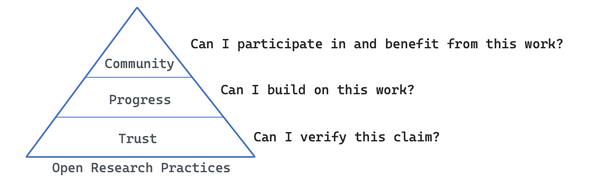

# Background {#sec-background}

## What is Open Science?

Open Science (or *Open Research*) is an approach to conducting and communicating research that aims to make all stages of the research process more transparent, accessible, reproducible, and collaborative. It extends beyond open access publishing to encompass the sharing of data, software, methods, materials, peer review, and other research outputs throughout the research lifecycle [@Hardwicke2024Open]. Together, these practices help build [trust](#sec-trust), accelerate [progress](#sec-progress), promote [equity](#sec-equity), and strengthen the research [community](#sec-community).

::: {.callout-note}

### "Open Science" and "Open Research"?

The terms _Open Science_ and _Open Research_ are often used interchangeably. _Open Science_ has become the internationally recognised term adopted by organisations such as UNESCO and the European Commission to describe a broad movement towards greater transparency, accessibility, collaboration, and reproducibility throughout the research process. Despite its name, UNESCO explicitly defines Open Science as encompassing the natural sciences, social sciences, humanities, and the arts [@unesco2021openscience]. Nevertheless, many scholars, particularly in the humanities, prefer the term _Open Research_, arguing that it more naturally reflects the diversity of scholarly traditions beyond the sciences [@adams2026]. Throughout this repository, we use _Open Research_ when referring to research practices across the full spectrum of music research, while recognising _Open Science_ as the broader international framework within which these practices have developed.
:::

::: {.callout-important}

### Should this repo be called?

- A. Open Science for Music Research (original proposal, OSMR)
- B. Open Research in Music (ORM)
- C. Open Music Research (OMR)
- D. Something else?
:::

## Why Open Research?

Open research serves several complementary purposes. At its foundation, it fosters **trust** by making research transparent, allowing others to scrutinise, verify, and reproduce scientific claims. Building on this, openness enables **progress** by transforming publications, data, code, and methods into reusable resources that accelerate cumulative discovery rather than requiring each project to start from scratch. Finally, open research supports **community** by supporting learning, collaboration, and engagement both within academia and beyond. This reveals the often hidden processes of scientific inquiry, enabling students and researchers to learn not only from published results but also from the decisions, workflows, and materials that produced them. Together, these three levels (trust, progress, and community) capture the broader value of open research as a foundation for more reliable, cumulative, and accessible science.

### Trust {#sec-trust}

Research advances through trust -- but not blind trust. Confidence in research findings is earned when claims can be inspected, questioned, and independently verified. Open research attempts to shift the basis of trust from the reputation of individual researchers to the transparency of the scientific process itself. Publications, data, analysis scripts, study materials, preregistrations, and peer review provide the evidence needed for others to evaluate, reproduce, and extend previous work [@nosek2015promoting].

This need is particularly pressing in music research, where studies often involve complex combinations of musical stimuli, behavioural or physiological measurements, computational analyses, and subjective interpretations. In music psychology, trust depends on knowing precisely which stimuli were used, how participants were recruited, how emotional or cognitive responses were measured, and how analyses were conducted. In music information retrieval (MIR) and computational musicology, reproducibility requires access to datasets, feature extraction pipelines, machine learning models, software versions, and evaluation procedures. Digital humanities projects frequently involve intricate data transformations, annotation decisions, and computational workflows that are impossible to fully describe within the constraints of a journal article. Even in historical musicology, where primary sources are often publicly available, transparency about editorial choices, coding decisions, and analytical procedures strengthens confidence in scholarly interpretations.

Open research makes these otherwise hidden aspects of research visible. Sharing data, code, materials, and complete analytical workflows allows others to verify findings, identify errors, assess methodological choices, and reproduce results. Transparency also _discourages_ questionable research practices by making research decisions more explicit and accountable. Importantly, openness does not guarantee that research is correct; rather, it allows the research community to _evaluate the strength of the evidence_ and to improve upon it over time.

Despite broad recognition of these benefits, adoption remains uneven. Within music psychology, for example, journal policies increasingly encourage researchers to share data and analysis scripts, yet voluntary encouragement alone has resulted in relatively limited uptake as a sample of studies in music psychology indicates that about 5% studies share data and 1% share analysis scripts [@eerola2023transparency]. Building a more trustworthy discipline therefore requires moving beyond encouragement towards research practices in which openness becomes the expected default rather than the exception.

Practices that contribute to trust include [open access publications](section2.qmd), [open data](section3.qmd), [open-source code, reproducible analytical workflows](section3.qmd), [replication studies](section5.qmd), [preregistration, Registered Reports](section7.qmd), and, where appropriate, [open peer review](section6.qmd). Together, these practices make scientific claims inspectable rather than merely believable.

### Progress {#sec-progress}

Research should not merely produce knowledge; it should enable future knowledge. Open research transforms publications, datasets, software, and analytical workflows into resources that others can reuse, extend, and improve [@lowndes2017our]. Rather than requiring every research group to rebuild datasets and methods from scratch, openness enables cumulative science. Data can be reused, software extended, methods refined, and findings independently replicated, allowing scientific knowledge to develop more efficiently.

These benefits are particularly important in music research. The creation of musical corpora is often resource intensive, involving recording, transcription, annotation, or specialist cultural knowledge [@hentschel2025corpus]. Behavioural ratings and expert annotations likewise require substantial effort and can support benchmarking, secondary analyses, and computational modelling when they are shared.

Progress also depends on transparent methods. Research in music psychology, music information retrieval, computational musicology, and the digital humanities frequently relies on complex computational pipelines that cannot be fully described in a journal article. Sharing code, software versions, and documentation allows others to reproduce, adapt, and extend these workflows. Open-source software also remains useful for longer when it is version-controlled, archived, and maintained by a wider community.

Finally, sharing alone is not enough. For research outputs to support cumulative science, they must be well documented and reusable. The FAIR principles—making data Findable, Accessible, Interoperable, and Reusable—highlight the importance of metadata, persistent repositories, clear licensing, and standardised formats that allow publications, datasets, code, and other research outputs to remain useful long after the original study has been completed [@wilkinson2016fair].

Practices that support progress include [FAIR data, shared datasets](section3.qmd), [reusable software](section4.qmd), [replication studies](section5.qmd), standardised metadata, persistent repositories, version control, and reproducible computational environments. Together, these practices transform individual research projects into lasting resources for collaboration, innovation, and cumulative scientific progress.

### Community {#sec-community}

Open research is fundamentally a community practice. Science advances not only through new discoveries but also through the exchange of knowledge, skills, methods, and resources that enable others to contribute. By making publications, data, code, workflows, and reviews openly available, researchers create opportunities for collaboration, mutual learning, and collective improvement. Open repositories reveal many aspects of research that are normally hidden from the published article, making the scientific process itself a shared community resource.

This community-building role extends across all areas of open science [@allen2021reproducibilitea]. Open access publications broaden participation in scholarship; open data and code enable researchers to verify findings, develop new analyses, and acquire practical skills; reproducible workflows provide examples of good research practice; preregistrations and Registered Reports demonstrate transparent study design; open peer review exposes the constructive dialogue that improves research; and replication studies reinforce the collective responsibility of maintaining a reliable scientific record.

Open science also fosters communities that extend beyond individual projects and institutions. Researchers benefit not only from shared resources but also from networks that exchange expertise, develop standards, and promote best practices [@mckiernan2016openscience]. Communities such as [ReproducibiliTea](https://reproducibilitea.org), [The Turing Way](https://book.the-turing-way.org), and discipline-specific open science initiatives provide training materials, discussion forums, workshops, mentoring, and collaborative support that help embed openness into everyday research practice.

Finally, openness increases the reach of music research beyond academia. Teachers, musicians, software developers, cultural organisations, policy makers, journalists, and interested members of the public can all benefit from unrestricted access to publications, data, educational resources, and software. By lowering barriers to participation, open research strengthens connections between researchers and the wider society, increasing both the visibility and the impact of music research.

### Equity {#sec-equity}

Open research promotes a more equitable scientific ecosystem by reducing barriers to accessing and contributing to knowledge [@unesco2021openscience]. The ability to read scientific publications, use research data, or apply analytical methods should not depend on the financial resources of an institution or the country in which a researcher works. Open Access publications, openly shared datasets, software, and educational resources help level the playing field by making high-quality research available to anyone with an internet connection.

Greater equity also broadens participation in science. Researchers in low-resource settings, independent scholars, students, practitioners, and citizen scientists can contribute more fully when knowledge and research tools are openly available. In music research, this is particularly important for supporting underrepresented musical traditions, fostering international collaboration, and enabling a more diverse range of perspectives to shape the discipline. By democratising access to knowledge and research resources, open science helps create a more inclusive and globally connected research community. However, achieving equity through open science is not automatic feature of the scheme but requires careful implementation and how stakeholders value and provide support for it [@bezuidenhout2025equity].

