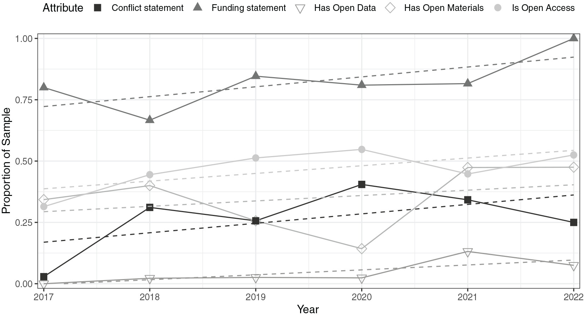

# Reproducible research {#sec-RR}

## What is "Reproducible research"?

_Reproducibility_ in research typically refers to the ability to obtain the same findings given the same data, code, and methods. This is possible when researchers share their data and code alongside a publication or make these materials available upon request. The advantage of sharing them alongside the publication is that the results remain reproducible even if the original author can no longer be reached.

The concept is closely related to _replicability_, but with an important distinction: whereas replicability refers to repeating a study by collecting new data or conducting a new experiment, reproducibility refers to repeating the data analysis using the same data, code, and other materials as in the original study. Although these terms are sometimes used interchangeably or are defined differently across disciplines [@plesserReproducibilityVsReplicability2018], we follow the definitions established by the [National Academies of Sciences](http://nationalacademies.org/) [@national2019reproducibility], which have also been [recently adopted](https://www.acm.org/publications/badging-terms) by the [Association for Computing Machinery](https://www.acm.org/) (ACM):

::: {.callout-tip}
## Definitions of reproducibility and replicability (National Academies of Sciences)
- **Reproducibility** is obtaining consistent results using the same input data; computational steps, methods, and code; and conditions of analysis
- **Replicability** is obtaining consistent results across studies aimed at answering the same scientific question, each of which has obtained its own data
:::

Reproducibility and replicability do not necessarily depend on each other: a study may be reproducible if the original analysis can be rerun, but it may not be replicable if the effect is not found in a new sample. Conversely, a finding might be replicated in some other context, but it may be irreproducible if the analysis code or data of the original study is not available or has issues.

|         | Replicable                                                                                                                                                                                                                                                                | Reproducible                                                                                                                                                                                                                                 |
|---------|---------------------------------------------------------------------------------------------------------------------------------------------------------------------------------------------------------------------------------------------------------------------------|----------------------------------------------------------------------------------------------------------------------------------------------------------------------------------------------------------------------------------------------|
| Meaning | A study can be repeated with *new data and/or methods* to obtain similar findings                                                                                                                                                                                         | A study's results can be recreated using the original data, code, and methods                                                                                                                                                                |
| Focus   | Repeat the research process                                                                                                                                                                                                                                               | Rerun the analysis                                                                                                                                                                                                                           |
| Example | @lundqvistEmotionalResponsesMusic2009 found that happy and sad music induced different psychological and physiological emotional responses; @bullackPsychophysiologicalResponsesHappy2018 repeated the experiment but used instrumental film music instead of vocal music | @bertoloExpandedNaturalHistory2025 introduce a large and globally diverse song corpus for cross-cultural research; the paper includes the [dataset and a script](https://github.com/themusiclab/nhs-expanded) to generate the entire manuscript, including analyses and visualizations |
: Replicability vs. reproducibility: repeating research with new data versus recreating results with original data and methods.

## Reproducibility and replication problems

While we would like all reported evidence to be reproducible, this is not always the case. @nosekReplicabilityRobustnessReproducibility2022 identifies two possible scenarios leading to such failures. The most common is a _process reproducibility failure_: there is insufficient access to data, code (or the information needed to recreate the code), software, or other resources required to reproduce the results. The second type is called _outcome reproducibility failure_, which occurs when a reanalysis can be performed, but results obtained differ from those originally reported. Outcome reproducibility failures may arise from issues in either the original study or the reproduction attempt.

*Reproducibility problems* can make replication more difficult because, in order to repeat a study (e.g., with a different sample of participants), it is important to know exactly what was done in the orginal research. Reproducibility was generally much more harder in the past, especially before modern software tooling: before the 1980s, calculations were often performed manually, and data was stored and shared on paper. After the personal computer revolution, and particularly before the widespread adoption of the internet, code was increasingly used butwas often not shared, and computational environments were more difficult to recreate [@peng2021reproducible]. Nowadays, version control systems, cloud storage, workflow management tools and public repositories greatly facilitate research reproducibility. However, despite these advances, reproducibility problems remain an important challenge in psychological research.

 *Replication problems* are currently a major concern, as many previously published findings have been difficult to replicate, owing to factors such as underpowered studies, differences in participants, contexts, and procedures across studies investigating the same phenomenon, and publication bias [@stanley2018meta]. In response to these challenges, various solutions have been proposed, ranging from the *registered report* format, where researchers submit the hypotheses and methods for peer review before collecting data [@obels2020analysis], to more stringent statistical standards for the psychological sciences [@johnson2017reproducibility].

Psychological research faces several factors that may increase the risk of false findings, including the complexity of human behaviour, the testing of multiple variables and hypotheses, and the use of relatively small sample sizes in many studies involving human participants. Furthermore, much of the research published in leading psychology journals is based on WEIRD (Western, Educated, Industrialized, Rich, and Democratic) populations, which are outliers on many measurable psychological dimensions compared with populations worldwide [@henrich2010most;@henrich2010weirdest].

## Reproducible music research

While music psychology has made some progress in recognizing these problems [@frieler2013replication; @eerola2023transparency] and promoting research transparency, it is clear that many studies still do not adopt practices that allow other scientists to easily verify and reproduce their analyses. @eerola2023transparency examined research articles from five music psychology journals and found that only 5% included data availability statements and just 1% provided data analysis scripts.



In recent years, researchers in music-related fields have published fully reproducible workflows in which the entire research pipeline can be recreated, from raw data processing to final manuscript (e.g., [@eerola2023transparency]; [@bertoloExpandedNaturalHistory2025]; [@cho2025ecological]).

## Workflow

A crucial challenge in reproducible research is how to create a well documented and straightforward set of instructions that would allow other researchers to independently reproduce study results [@antunes2024reproducibility]. One approach to addressing this problem is literate programming [@knuth1984literate], which essentially consists of creating documents containing explanations of procedures or algorithms interleaved with source code snippets embedded within the text. For instance:

::: {.callout-note}
## Literate programming example
To estimate the global tempo of the musical recording using [MIRtoolbox](https://github.com/olivierlar/mirtoolbox), we first import it as an audio object using `miraudio` and then compute its tempo via `mirtempo`:
```matlab
s = miraudio('my_song.wav');
t = mirtempo(s);
```
The variable `t` will contain the estimated tempo, expressed in beats per minute (BPM).
:::

A modern realization of this idea is provided by interactive notebooks, which allow not only the presentation of neatly formatted code and text cells, but also the execution of code. [Project Jupyter](https://jupyter.org/) is one of the most widely used interactive notebook environments and has grown rapidly from its initial focus on the [Julia](https://julialang.org/), [Python](https://www.python.org/), and [R](https://www.r-project.org/) languages to supporting over 100 programming languages through its kernel ecosystem. Cloud-based environments based on Jupyter, such as [Google Colab](https://colab.research.google.com/) and [JupyterHub](https://jupyter.org/hub), further simplify setup and workflows by executing code remotely, meaning that computations are carried out on remote servers rather than on a local machine. This makes it possible to create interactive online resources for teaching, such as online textbooks on audio analysis [@ali2025tangible] and music processing [@muller2015fundamentals].

Beyond interactive notebooks, more complex endeavors require a clear project structure, including, for example, a README file, a file specifying software dependencies, and subfolders for data, code, results, and the manuscript itself. In fully reproducible research workflows, all analyses, including the creation of tables and figures, are regenerated, and in some cases even the entire manuscript is compiled using tools such as [Quarto](https://quarto.org/) or [R Markdown](https://rmarkdown.rstudio.com/). Cloud-based platforms for sharing, running, and reproducing code, such as [Code Ocean](https://codeocean.com/), have been used to ensure that the published results can be recreated by others. Other relevant cloud services facilitating the reproducibility of research workflows include [Renku](https://renkulab.io/) and [Whole Tale](https://wholetale.org/).

Because code, analysis decisions, and manuscript content are subject to change over the course of a research process (and because it may be necessary to go back and forth between different versions of a pipeline), *version control* can greatly facilitate these workflows. [Git](https://git-scm.com/) is currently the most widely used version control system, and [GitHub](https://github.com/) is a popular Git hosting service that supports collaborative software development.
