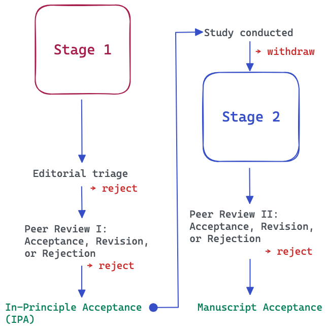

# Preregistration {#sec-registration}

## Existence of systematic bias

In scholarly work, it is not unusual for researchers to prefer certain outcomes over others, to hope that findings support a particular theory, or to give less attention to results that fail to confirm initial expectations. Such tendencies are well documented in the history of science and can be regarded as sources of *systematic bias* in the research process [@lakens2024benefits]. Preregistration is one approach to reducing such bias. It increases transparency by documenting the claims, hypotheses, and analytical plans before the results are known, allowing others to evaluate how conclusions were reached. It may also help reduce *publication bias*, the tendency for positive or statistically significant findings to be published more frequently than null or negative results.

In music research, as in many other disciplines, there are numerous opportunities for systematic bias to arise. Statistical analyses may be conducted selectively, with researchers choosing among multiple analytical options after inspecting the data. Variables, outcome measures, or subsets of data may be reported opportunistically because they produce more favourable results. Research questions and hypotheses may also shift after the results are known, a practice commonly referred to as HARKing (*Hypothesising After the Results are Known*). Importantly, such practices are not always intentional. Researchers may be unaware that repeated reanalysis of data, selective reporting, or exploration of numerous analytical pathways can introduce bias into the final conclusions. Nevertheless, examples of these practices are easy to find, and together they illustrate how systematic bias can emerge in empirical research even when researchers act in good faith.

## Definition of preregistration

Preregistration is designed to counteract systematic biases by making key research decisions transparent before data collection or analysis. Following the definition proposed by @lakens2024benefits, preregistration is:

> "a complete description of all information related to planned analyses (including the experimental design, measures, data preprocessing, and when statistical tests will corroborate or falsify predictions) that is demonstrably created without access to the data that will be analysed."

In practical terms, this means that researchers document their study procedures, hypotheses, and statistical analysis plans before collecting or analysing data. When data already exist, typically because they were collected by other researchers, it is still possible to preregister an analysis plan, provided that researchers can demonstrate they did not have access to the data before developing the plan [@mertens2019preregistration].

In some areas of music research, such as corpus studies, this principle may be more difficult to uphold because many datasets are openly available and can often be accessed without any formal request process. This makes it harder to verify that analytical decisions were specified before researchers examined the data. One way to mitigate this challenge is to maintain open laboratory notebooks or other time-stamped records that document decisions, analyses, and claims as they develop throughout the research process [@scroggie2023github].

## Variants of preregistration

Preregistration practices originated in clinical and medical research. Clinical trial registries began to emerge in the late 1990s and became increasingly required during the 2000s through journal and regulatory policies. These registries provide a searchable record of a study's aims, design, methods, and planned outcomes before results are known.

Outside clinical research, preregistration has evolved into several formats that differ in complexity and level of scrutiny. These range from brief registrations that document core hypotheses and analyses, to comprehensive preregistrations that specify study procedures and analytical decisions in detail, and ultimately to *Registered Reports*, where study plans undergo peer review before data collection begins. Although these approaches vary in their requirements, they share the common goal of increasing transparency and reducing opportunities for bias in the research process. @tbl-services lists five common services for study preregistrations in order of complexity.

| Service          | Typical use                                          | Complexity  |
|:---------------- |:---------------------------------------------------- | ----------- |
| [AsPredicted](https://aspredicted.org/)                                         | Simple hypothesis-testing studies                    | Low         |
| [OSF Registries](https://osf.io/registries)                                     | General-purpose preregistration for any study type   | Medium |
| [PROSPERO](https://www.crd.york.ac.uk/prospero/)                                | Systematic reviews and meta-analyses                 | Medium      |
| [Registered Reports Center (COS)](https://www.cos.io/rr)                        | Registered Reports and participating journals        | High        |
| [Open Science Framework Registered Report Templates](https://osf.io/registries) | Detailed preregistrations and Stage-1 RR submissions | High        |
| [ClinicalTrials.gov](https://clinicaltrials.gov/)                               | Clinical trials and intervention studies             | High        |

: Five preregistration services. {#tbl-services}

### Minimal preregistration

In a minimal preregistration, the key claims tested will be identified. This should include

- Research question(s)
- Hypotheses
- Primary outcome variable(s)
- Planned sample size
- Main statistical test(s)

Several online repositories, such as [AsPredicted](https://aspredicted.org/) and [OSF Registries](https://osf.io/registries), support study preregistration (see @tbl-services). These services provide structured templates that guide researchers in documenting the key elements of their study design, hypotheses, and analysis plans. Once submitted, the preregistration is stored as a time-stamped record, creating verifiable evidence that the research plan existed before data collection or analysis.

::: {.callout-note}
#### Minimal preregistration example

A good example of preregistration in music psychology is a study about music emotion recognition and specific traits in early childhood by @paz2025hearing. They wanted to examine children aged 3 to 5 and whether those children who score high on callous-unemotional trait have poorer recognition ability than others. Their [preregistration at aspredicted.org](https://aspredicted.org/3d4d-d93v.pdf) covers the design, sample size, and the main analysis (including some exploratory analyses) strategy, although it is by no means comprehensive. The results showed that indeed children higher on callous‐unemotional traits showed poorer emotion recognition scores.
:::

Most preregistration services also provide options for embargoing or anonymising registrations, allowing researchers to preserve the requirements of double-blind peer review while still benefiting from the transparency afforded by preregistration.

### Full preregistration

In a full preregistration, an attempt to document all major decisions that relate to the study before collecting the data. This will usually include:

- Detailed study design and procedure
- Recruitment criteria
- Inclusion and exclusion criteria
- Sample size justification (e.g., power analysis)
- Music (or other stimuli) used
- Variables collected
- Data preprocessing steps
- Handling of missing data
- Outlier criteria
- Statistical models
- Covariates (if any)
- Multiple-comparison corrections
- Planned exploratory analyses

::: {.callout-note}
#### Full preregistration example

@lowebrown2026 tested whether playlists that gradually transition from music matching a listener's current mood to music reflecting a desired mood are more effective for emotion regulation than alternative playlist structures. The authors preregistered their [hypotheses, design, outcome measures, and analysis plan in OSF](https://osf.io/kmu4g) before collecting data, thereby clearly distinguishing confirmatory tests of the so-called iso principle from any subsequent exploratory analyses. The [study found](https://journals.sagepub.com/doi/full/10.1177/10298649261421187) only limited support for the iso principle, demonstrating how preregistration can increase the credibility of findings by ensuring that null or mixed results are reported transparently rather than being obscured through post hoc hypothesis modification.
:::

### Registered Reports

*Registered Reports* take preregistration one step further than the approaches described above. In this format, a complete study proposal—including the background, aims, design, materials, and analysis plan—is submitted to a journal that accepts Registered Reports. At this stage, no data have been collected or analysed.

This submission, known as the *Stage 1 manuscript*, undergoes peer review. Reviewers evaluate the importance of the research question, the quality of the study design, the adequacy of the planned analyses, and the overall rigour of the proposed methodology. This adds an important layer of quality control to preregistration, as weaknesses in the design, sampling strategy, materials, or analysis plan can be identified and addressed before data collection begins.

Following Stage 1 review, the journal may reject the manuscript, request revisions, or grant *in-principle acceptance* (IPA). An IPA means that the journal commits to publishing the study regardless of the outcome, provided that the approved protocol is followed, any deviations are transparently documented, and the conclusions are supported by the evidence.

After receiving IPA, researchers collect and analyse the data according to the approved protocol. Any departures from the original plan should be clearly justified and documented. The completed manuscript, now including the results and discussion, is then submitted for *Stage 2 review*. At this stage, reviewers assess whether the study was conducted as approved, whether deviations have been adequately reported, and whether the conclusions are justified by the findings. Importantly, publication does not depend on whether the results are statistically significant, novel, or supportive of the original hypotheses.

{width=50%}

Beyond reducing systematic bias and publication bias, Registered Reports offer an additional benefit: expert feedback is obtained before data collection begins. This allows reviewers to improve aspects of the study that are difficult or impossible to change later, such as the design, stimuli, sampling strategy, statistical analyses, or power considerations.

::: {.callout-note}
#### Registered Report example

Lahdelma and Eerola [-@lahdelmaeerola2024] used the Registered Reports format to investigate the emotional connotations of musical chords (major, minor, augmented, diminished, and suspended fourth chords) using an affective priming paradigm. Their 9-page [Stage 1 manuscript](https://osf.io/x8yvk) contained a detailed description of the study rationale, hypotheses, methods, stimuli, procedure, sample size justification, planned analyses, inclusion and exclusion criteria, and treatment of outliers.

During Stage 1 review, peer reviewers suggested several improvements to the hypotheses, stimulus selection criteria, and planned analyses. Following *in-principle acceptance*, the researchers collected data from the planned sample of 400 participants and conducted the analyses according to the approved protocol.

Not all preregistered hypotheses were supported. For example, the data did not support the prediction that suspended fourth chords would produce the expected affective priming effects. This illustrates one of the central strengths of the Registered Reports format: studies are published regardless of whether the results confirm the original hypotheses, provided that the approved protocol has been followed and the conclusions are supported by the evidence. In a public [blog post](https://tuomaseerola.github.io/preregistration/), the authors reflected positively on the Registered Reports process, highlighting the value of receiving methodological feedback before data collection, while also noting the additional time and effort required to prepare and revise the Stage 1 manuscript.

:::

It is worth noting that currently one journal in the domain of music supports Registered Reports ([Music Perception](https://online.ucpress.edu/mp/pages/submit). An alternative route to publishing a Registered Report is offered by Peer Community In Registered Reports ([PCI RR](https://rr.peercommunityin.org/about/pci_rr_friendly_journals)). PCI RR is an independent peer-review platform that evaluates Registered Reports in a manner similar to the Stage 1 review process used by journals. If the proposal successfully passes review, PCI RR issues an In-Principle Recommendation (IPR), which functions similarly to the in-principle acceptance granted by a journal. Researchers then conduct the study according to the approved protocol and submit the completed manuscript for Stage 2 review. A growing number of [PCI RR-friendly journals](https://rr.peercommunityin.org/about/pci_rr_friendly_journals) have agreed to consider manuscripts that have successfully completed the PCI RR review process.

## Summary

For music research, a minimal preregistration is already a substantial improvement over no preregistration. Full preregistration becomes particularly valuable when a study involves numerous or complex analytical decisions, such as feature selection in music information retrieval studies, psychophysiological analyses, longitudinal designs, or scale-development projects. Metascientic research has shown that preregistraton has increased the quality of scholarship in the areas where it has been used [@ofosu2023pre;@vanakker2024]. 

However, preregistration should not be viewed as a solution for every type of study. It is most valuable when evaluating predefined hypotheses and claims. Research that is primarily exploratory, interpretative, or practice-based may not be well suited to comprehensive preregistration. In other words, preregistration is less useful when the primary goal is exploration, discovery, interpretation, or creative practice rather than hypothesis testing.

In such cases, transparency remains equally important and can be promoted through other open research practices, including sharing materials and data, maintaining open notebooks, documenting analytical decisions, and providing reflexive accounts of the research process. These approaches help make the development of ideas, interpretations, and conclusions more transparent, even when preregistration is neither feasible nor appropriate.

